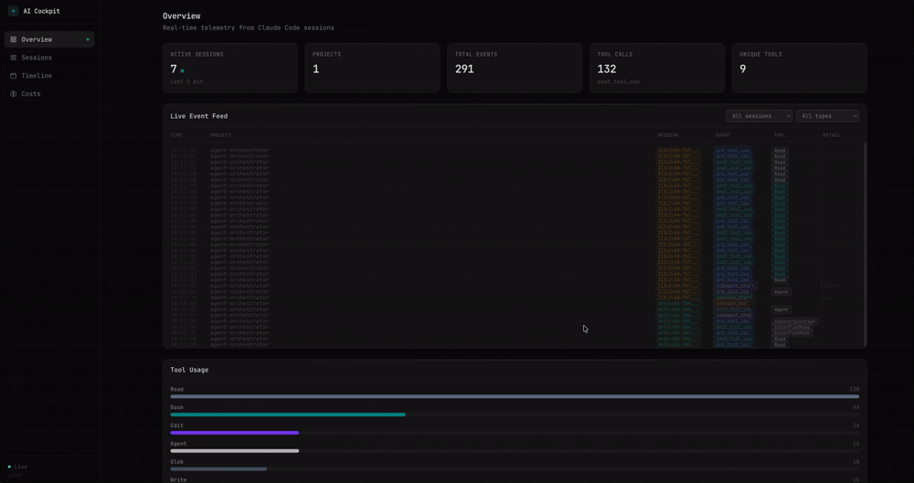

# AI Cockpit



Real-time observability dashboard for Claude Code agent sessions.

## Why

AI coding agents are powerful but opaque. When Claude Code runs across multiple projects and sessions, you have no visibility into what it's doing, how often it uses specific tools, which projects are most active, or how long sessions last.

AI Cockpit gives you that visibility. It captures every lifecycle event from Claude Code — session starts, tool calls, subagent spawns, stops — and streams them to a live dashboard. Think of it as DevTools for your AI coding workflow.

### What you get

- **Real-time event stream** — see every tool call as it happens across all projects
- **Session tracking** — monitor active sessions, their duration, model used, and tool call counts
- **Project-level aggregation** — understand which projects consume the most agent activity
- **Tool usage breakdown** — identify which tools (Bash, Read, Write, Edit, etc.) are used most
- **Timeline visualization** — swim-lane view showing concurrent session activity over time
- **Multi-project support** — one dashboard for all your Claude Code projects

### Use cases

- **Team leads**: Monitor AI agent usage across team projects
- **Individual developers**: Track your own agent sessions to understand usage patterns
- **Cost awareness**: See session frequency and tool call volume to anticipate API costs
- **Debugging**: Investigate what an agent did during a specific session with full event drill-down

## How It Works

```
Claude Code hooks → telemetry.py → HTTP POST → API Server → WebSocket → Dashboard
```

Claude Code fires [hooks](https://code.claude.com/docs/en/hooks) at lifecycle events. A lightweight Python script (`telemetry.py`) captures the event JSON from stdin, extracts useful fields (session ID, project, tool name, model, agent type), and POSTs it to the API server. The server stores events in SQLite and broadcasts them to connected dashboard clients over WebSocket.

### Events captured

| Hook Event | What it captures |
|---|---|
| `SessionStart` | Session begins — model name, project |
| `SessionEnd` | Session ends |
| `PreToolUse` | Tool call about to execute — tool name, input |
| `PostToolUse` | Tool call completed — tool name, input |
| `Stop` | Agent finished responding |
| `SubagentStart` | Subagent spawned — agent type (Explore, Plan, etc.) |
| `SubagentStop` | Subagent finished |

## Quick Start

### 1. Start the API server

```bash
cd server
bun install
bun run dev     # starts on http://localhost:7777
```

### 2. Start the dashboard

```bash
cd dashboard
bun install
bun run dev     # starts on http://localhost:5173
```

### 3. Configure Claude Code hooks

Copy the hooks directory into your project's `.claude/` folder:

```bash
cp -r .claude/hooks /path/to/your-project/.claude/hooks
```

Then add the hook configuration to your project's `.claude/settings.json`:

```json
{
  "hooks": {
    "SessionStart": [{ "matcher": "*", "hooks": [{ "type": "command", "command": "python3 ${CLAUDE_PROJECT_DIR}/.claude/hooks/telemetry.py session_start", "timeout": 5000 }] }],
    "SessionEnd": [{ "matcher": "*", "hooks": [{ "type": "command", "command": "python3 ${CLAUDE_PROJECT_DIR}/.claude/hooks/telemetry.py session_end", "timeout": 5000 }] }],
    "PreToolUse": [{ "matcher": "*", "hooks": [{ "type": "command", "command": "python3 ${CLAUDE_PROJECT_DIR}/.claude/hooks/telemetry.py pre_tool_use", "timeout": 5000 }] }],
    "PostToolUse": [{ "matcher": "*", "hooks": [{ "type": "command", "command": "python3 ${CLAUDE_PROJECT_DIR}/.claude/hooks/telemetry.py post_tool_use", "timeout": 5000 }] }],
    "Stop": [{ "matcher": "*", "hooks": [{ "type": "command", "command": "python3 ${CLAUDE_PROJECT_DIR}/.claude/hooks/telemetry.py stop", "timeout": 5000 }] }],
    "SubagentStart": [{ "matcher": "*", "hooks": [{ "type": "command", "command": "python3 ${CLAUDE_PROJECT_DIR}/.claude/hooks/telemetry.py subagent_start", "timeout": 5000 }] }],
    "SubagentStop": [{ "matcher": "*", "hooks": [{ "type": "command", "command": "python3 ${CLAUDE_PROJECT_DIR}/.claude/hooks/telemetry.py subagent_stop", "timeout": 5000 }] }]
  }
}
```

`${CLAUDE_PROJECT_DIR}` is resolved by Claude Code at runtime to the project root. The telemetry script uses only Python 3 stdlib — no pip install needed.

## Architecture

| Component | Port | Stack |
|---|---|---|
| API Server | `7777` | Bun + SQLite (WAL mode) + WebSocket |
| Dashboard | `5173` | React + Vite + Tailwind CSS 3.4 + Framer Motion |
| Hook Script | — | Python 3 (stdlib only) |

### API Endpoints

| Method | Path | Description |
|---|---|---|
| `POST` | `/events` | Receive telemetry events |
| `GET` | `/events` | Query events (filter by `session_id`, `event_type`, `limit`) |
| `GET` | `/sessions` | List all sessions with aggregated stats |
| `GET` | `/sessions/:id` | Get all events for a specific session |
| `GET` | `/stats` | Dashboard summary (active sessions, totals, projects) |
| `GET` | `/tools` | Tool usage breakdown |
| `GET` | `/health` | Health check |
| `WS` | `/ws` | Real-time event stream |

### Dashboard Pages

- **Overview** — Live stat cards, real-time event feed table, tool usage chart
- **Sessions** — Session list with project, model, duration, event/tool counts, drill-down detail view
- **Timeline** — Swim-lane visualization of concurrent session activity
- **Costs** — Placeholder for token/cost tracking (pending hook API support for token data)

### Database Schema

Events are stored in a single `events` table:

```
id | event_type | session_id | project | tool_name | tool_input | model | agent_type | agent_id | timestamp | created_at
```

SQLite with WAL mode for concurrent reads. The database file lives at `server/data/cockpit.db` and is gitignored.

## Development

Both server and dashboard auto-reload on file changes:

```bash
# Terminal 1
cd server && bun run dev

# Terminal 2
cd dashboard && bun run dev
```

To seed the database with sample data:

```bash
cd server && bun run seed
```

To reset the database, delete `server/data/cockpit.db` and restart the server.
